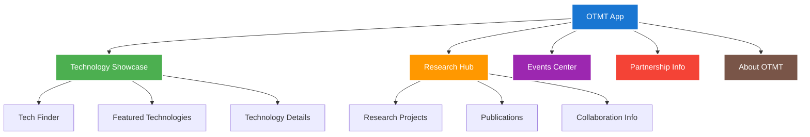
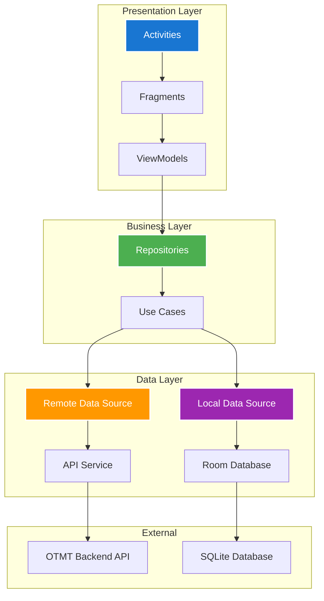
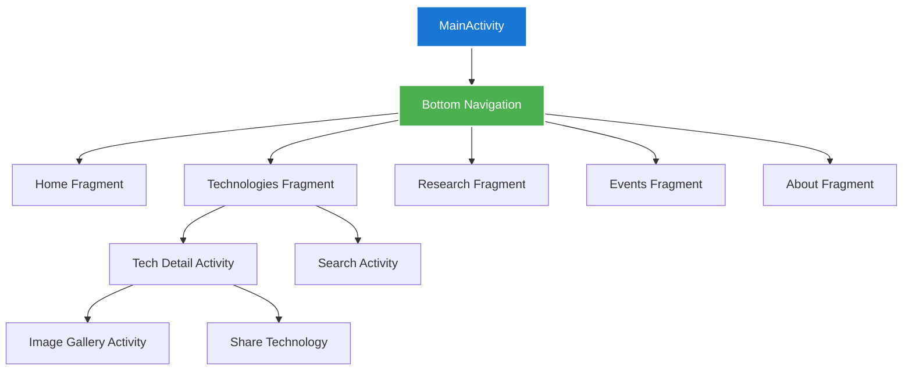

# OTMT Android Application

<div align="center">
  <h3>📱 Native Android Experience</h3>
  <p><em>Bringing OTMT's innovation ecosystem to your fingertips</em></p>
  
  []()
  []()
  []()
  []()
</div>

---

## 📋 Table of Contents

- [Overview](#-overview)
- [Why Native Android?](#-why-native-android)
- [Features](#-features)
- [Tech Stack](#-tech-stack)
- [Architecture](#-architecture)
- [Installation](#-installation)
- [Development Setup](#-development-setup)
- [App Structure](#-app-structure)
- [Key Components](#-key-components)
- [API Integration](#-api-integration)
- [Performance](#-performance)
- [Building & Deployment](#-building--deployment)
- [Testing](#-testing)

## 🌟 Overview

The OTMT Android Application brings the complete **Office of Technology Management and Transfer** experience to mobile devices through a **fully native Android application**. Built with Kotlin and modern Android development practices, it provides seamless access to institutional technologies, research projects, and innovation showcases.

### 🎯 Mission
Extend OTMT's reach beyond desktop computers, enabling **on-the-go access** to technology databases, research information, and innovation showcases for students, faculty, and external stakeholders.

### ✨ Key Highlights
- **100% Native**: Built with Kotlin for optimal performance
- **Brand Consistency**: Perfect visual alignment with web platform
- **Offline Capable**: Core features work without internet connectivity
- **Performance Optimized**: Smooth 60fps experience across all devices
- **Security First**: Secure API communication with certificate pinning

## 🚀 Why Native Android?

### ❌ **React Native Limitations**
- Performance overhead for complex UI animations
- Limited access to latest Android features
- Bridge communication delays
- Platform-specific customization challenges

### ✅ **Native Android Advantages**
- **Performance**: Direct access to Android APIs and hardware
- **User Experience**: Platform-native feel and interactions
- **Feature Access**: Full access to Android capabilities
- **Optimization**: Platform-specific optimizations and best practices
- **Future-Proof**: Easy adoption of new Android features

## ✨ Features

### 📊 **Core Functionality**

#### 🏠 **Information Hub**


#### 📱 **Mobile-Optimized UX**
- **Responsive Layouts**: Perfect adaptation to all screen sizes
- **Gesture Navigation**: Intuitive swipe and scroll interactions
- **Material Design**: Consistent with Android design principles

#### 🌐 **Offline Capabilities**
- **Data Caching**: Strategic caching of frequently accessed content
- **Offline Reading**: Browse cached technologies without internet
- **Sync Management**: Intelligent background synchronization
- **Storage Optimization**: Efficient local data management

### 🎨 **User Experience Features**

#### ⚡ **Performance Optimizations**
- **Memory Management**: Efficient memory usage and garbage collection
- **Network Efficiency**: Smart API calls with request batching
- **Battery Optimization**: Background task management

## 🛠 Tech Stack

### **Core Technologies**
- **Language**: Kotlin 100%
- **UI Framework**: Android XML Layouts
- **Architecture**: MVVM (Model-View-ViewModel)
- **Dependency Injection**: Dagger Hilt
- **Network**: Retrofit2 + OkHttp3
- **Image Loading**: Glide
- **Database**: Room (SQLite)

### **Android Components**
- **Min SDK**: Android 5.0 (API 21)
- **Target SDK**: Android 14 (API 34)
- **Build System**: Gradle with Kotlin DSL
- **Testing**: JUnit5 + Espresso
- **CI/CD**: GitHub Actions

### **Libraries & Dependencies**
```kotlin
// Core Android
implementation 'androidx.core:core-ktx:1.12.0'
implementation 'androidx.appcompat:appcompat:1.6.1'
implementation 'com.google.android.material:material:1.11.0'

// Architecture Components
implementation 'androidx.lifecycle:lifecycle-viewmodel-ktx:2.7.0'
implementation 'androidx.navigation:navigation-fragment-ktx:2.7.6'

// Network & API
implementation 'com.squareup.retrofit2:retrofit:2.9.0'
implementation 'com.squareup.okhttp3:logging-interceptor:4.12.0'

// Image Loading
implementation 'com.github.bumptech.glide:glide:4.16.0'

// Database
implementation 'androidx.room:room-ktx:2.6.1'
```

## 🏗 Architecture

### **MVVM Architecture Pattern**


### **Project Structure**
```
app/
├── src/main/kotlin/com/otmt/android/
│   ├── data/                    # Data layer
│   │   ├── api/                # API interfaces & models
│   │   ├── database/           # Room database
│   │   ├── repository/         # Repository implementations
│   │   └── models/             # Data models
│   ├── domain/                 # Business logic
│   │   ├── repository/         # Repository interfaces
│   │   ├── usecase/           # Business use cases
│   │   └── models/            # Domain models
│   ├── presentation/           # UI layer
│   │   ├── activities/        # Activity classes
│   │   ├── fragments/         # Fragment classes
│   │   ├── viewmodels/        # ViewModel classes
│   │   └── adapters/          # RecyclerView adapters
│   ├── di/                    # Dependency injection
│   ├── utils/                 # Utility classes
│   └── constants/             # App constants
├── src/main/res/              # Resources
│   ├── layout/               # XML layouts
│   ├── values/               # Strings, colors, styles
│   ├── drawable/             # Images and drawables
│   └── navigation/           # Navigation graphs
└── src/test/                 # Unit tests
```

## 🚀 Installation

### **Prerequisites**
```bash
# Required software
Android Studio Arctic Fox or later
JDK 11 or higher
Android SDK (API 21-34)
Git
```

### **Development Setup**

#### **1. Clone Repository**
```bash
git clone https://github.com/devan1shX/OTMT-App.git
cd OTMT-App
```

#### **2. Android Studio Setup**
```bash
# Open in Android Studio
# File -> Open -> Select OTMT-App directory

# Wait for Gradle sync to complete
# Install any missing SDK components when prompted
```

#### **3. Configuration**
```kotlin
// app/src/main/kotlin/com/otmt/android/constants/ApiConstants.kt
object ApiConstants {
    const val BASE_URL = "https://api.otmt.iiitd.ac.in/"
    // For development, change to: "http://10.0.2.2:5000/"
    
    const val CONNECT_TIMEOUT = 30L
    const val READ_TIMEOUT = 30L
    const val WRITE_TIMEOUT = 30L
}
```

#### **4. Build & Run**
```bash
# Via Android Studio
# Click "Run" button or Ctrl+R

# Via Command Line
./gradlew assembleDebug
./gradlew installDebug
```

## 📱 App Structure

### **Navigation Architecture**


### **Key Activities & Fragments**

#### **MainActivity.kt**
```kotlin
class MainActivity : AppCompatActivity() {
    private lateinit var binding: ActivityMainBinding
    
    override fun onCreate(savedInstanceState: Bundle?) {
        super.onCreate(savedInstanceState)
        binding = ActivityMainBinding.inflate(layoutInflater)
        setContentView(binding.root)
        
        setupBottomNavigation()
        setupStatusBar()
    }
    
    private fun setupBottomNavigation() {
        val navController = findNavController(R.id.nav_host_fragment)
        binding.bottomNavigation.setupWithNavController(navController)
    }
}
```

#### **TechnologiesFragment.kt**
```kotlin
@AndroidEntryPoint
class TechnologiesFragment : Fragment() {
    private val viewModel: TechnologiesViewModel by viewModels()
    private lateinit var adapter: TechnologiesAdapter
    
    override fun onCreateView(
        inflater: LayoutInflater,
        container: ViewGroup?,
        savedInstanceState: Bundle?
    ): View {
        binding = FragmentTechnologiesBinding.inflate(inflater, container, false)
        setupRecyclerView()
        observeViewModel()
        return binding.root
    }
    
    private fun setupRecyclerView() {
        adapter = TechnologiesAdapter { technology ->
            findNavController().navigate(
                TechnologiesFragmentDirections
                    .actionTechnologiesToTechDetail(technology.id)
            )
        }
        binding.recyclerView.adapter = adapter
    }
}
```

## 🔌 API Integration

### **Retrofit API Service**
```kotlin
@HiltModule
@InstallIn(SingletonComponent::class)
object NetworkModule {
    
    @Provides
    @Singleton
    fun provideOkHttpClient(): OkHttpClient {
        return OkHttpClient.Builder()
            .addInterceptor(HttpLoggingInterceptor().apply {
                level = HttpLoggingInterceptor.Level.BODY
            })
            .connectTimeout(ApiConstants.CONNECT_TIMEOUT, TimeUnit.SECONDS)
            .readTimeout(ApiConstants.READ_TIMEOUT, TimeUnit.SECONDS)
            .build()
    }
    
    @Provides
    @Singleton
    fun provideRetrofit(okHttpClient: OkHttpClient): Retrofit {
        return Retrofit.Builder()
            .baseUrl(ApiConstants.BASE_URL)
            .client(okHttpClient)
            .addConverterFactory(GsonConverterFactory.create())
            .build()
    }
}
```

### **API Service Interface**
```kotlin
interface OtmtApiService {
    @GET("api/technologies")
    suspend fun getTechnologies(
        @Query("page") page: Int? = null,
        @Query("limit") limit: Int? = null,
        @Query("search") search: String? = null,
        @Query("genre") genre: String? = null,
        @Query("trl") trl: Int? = null
    ): Response<TechnologiesResponse>
    
    @GET("api/technologies/{id}")
    suspend fun getTechnologyById(
        @Path("id") id: String
    ): Response<Technology>
    
    @GET("api/events")
    suspend fun getEvents(
        @Query("isActive") isActive: Boolean? = null
    ): Response<EventsResponse>
}
```

### **Repository Implementation**
```kotlin
@Singleton
class TechnologyRepository @Inject constructor(
    private val apiService: OtmtApiService,
    private val technologyDao: TechnologyDao
) {
    
    suspend fun getTechnologies(
        page: Int? = null,
        search: String? = null,
        forceRefresh: Boolean = false
    ): Flow<Resource<List<Technology>>> = flow {
        emit(Resource.Loading())
        
        // Emit cached data first
        val cachedData = technologyDao.getAllTechnologies()
        if (cachedData.isNotEmpty() && !forceRefresh) {
            emit(Resource.Success(cachedData))
        }
        
        try {
            val response = apiService.getTechnologies(page = page, search = search)
            if (response.isSuccessful) {
                response.body()?.let { technologiesResponse ->
                    // Cache the data
                    technologyDao.insertTechnologies(technologiesResponse.data)
                    emit(Resource.Success(technologiesResponse.data))
                }
            } else {
                emit(Resource.Error("Failed to fetch technologies"))
            }
        } catch (e: Exception) {
            emit(Resource.Error(e.localizedMessage ?: "Network error"))
        }
    }
}
```

#### **RecyclerView Optimizations**
```kotlin
class TechnologiesAdapter : ListAdapter<Technology, TechnologiesAdapter.ViewHolder>(DiffCallback) {
    
    // ViewHolder pattern for optimal scrolling
    class ViewHolder(private val binding: ItemTechnologyBinding) : RecyclerView.ViewHolder(binding.root) {
        fun bind(technology: Technology, clickListener: (Technology) -> Unit) {
            binding.technology = technology
            binding.clickListener = clickListener
            binding.executePendingBindings() // Important for data binding performance
        }
    }
    
    // DiffUtil for efficient list updates
    companion object DiffCallback : DiffUtil.ItemCallback<Technology>() {
        override fun areItemsTheSame(oldItem: Technology, newItem: Technology): Boolean {
            return oldItem.id == newItem.id
        }
        
        override fun areContentsTheSame(oldItem: Technology, newItem: Technology): Boolean {
            return oldItem == newItem
        }
    }
}
```

### **Performance Metrics**
- **App Launch Time**: < 4 seconds cold start
- **Screen Transitions**: 60 FPS smooth animations
- **API Response Handling**: < 500ms for cached data
- **Memory Usage**: < 50MB average runtime usage
- **Battery Impact**: Minimal background processing

## 🏗 Building & Deployment

### **Build Configurations**
```kotlin
// app/build.gradle.kts
android {
    compileSdk 34
    
    defaultConfig {
        applicationId "com.otmt.android"
        minSdk 21
        targetSdk 34
        versionCode 1
        versionName "1.0.0"
    }
    
    buildTypes {
        debug {
            isDebuggable = true
            applicationIdSuffix = ".debug"
            versionNameSuffix = "-debug"
            buildConfigField("String", "API_URL", "\"http://10.0.2.2:5000/\"")
        }
        
        release {
            isMinifyEnabled = true
            proguardFiles(getDefaultProguardFile("proguard-android-optimize.txt"), "proguard-rules.pro")
            buildConfigField("String", "API_URL", "\"https://api.otmt.iiitd.ac.in/\"")
            
            // Signing configuration
            signingConfig = signingConfigs.getByName("release")
        }
    }
    
    // Build optimization
    compileOptions {
        sourceCompatibility = JavaVersion.VERSION_11
        targetCompatibility = JavaVersion.VERSION_11
    }
    
    kotlinOptions {
        jvmTarget = "11"
    }
}
```

### **Release Build Process**
```bash
# Generate signed APK
./gradlew assembleRelease

# Generate App Bundle (recommended for Play Store)
./gradlew bundleRelease

# Install release build for testing
./gradlew installRelease
```

### **ProGuard Configuration**
```proguard
# app/proguard-rules.pro

# Keep API models
-keep class com.otmt.android.data.models.** { *; }

# Retrofit
-keepattributes Signature, InnerClasses, EnclosingMethod
-keepattributes RuntimeVisibleAnnotations, RuntimeVisibleParameterAnnotations
-keep,allowshrinking,allowoptimization class retrofit2.** { *; }

# Glide
-keep public class * extends com.bumptech.glide.module.AppGlideModule
-keep class com.bumptech.glide.GeneratedAppGlideModuleImpl
```

## 🧪 Testing

### **Unit Testing Structure**
```kotlin
// TechnologyRepositoryTest.kt
@OptIn(ExperimentalCoroutinesApi::class)
@ExtendWith(MockitoExtension::class)
class TechnologyRepositoryTest {
    
    @Mock private lateinit var apiService: OtmtApiService
    @Mock private lateinit var technologyDao: TechnologyDao
    
    private lateinit var repository: TechnologyRepository
    
    @BeforeEach
    fun setup() {
        repository = TechnologyRepository(apiService, technologyDao)
    }
    
    @Test
    fun `getTechnologies returns cached data when network fails`() = runTest {
        // Given
        val cachedTechnologies = listOf(mockTechnology())
        whenever(technologyDao.getAllTechnologies()).thenReturn(cachedTechnologies)
        whenever(apiService.getTechnologies()).thenThrow(IOException())
        
        // When
        val result = repository.getTechnologies().first()
        
        // Then
        assertTrue(result is Resource.Success)
        assertEquals(cachedTechnologies, result.data)
    }
}
```

### **UI Testing with Espresso**
```kotlin
@RunWith(AndroidJUnit4::class)
class TechnologiesFragmentTest {
    
    @get:Rule
    val activityRule = ActivityScenarioRule(MainActivity::class.java)
    
    @Test
    fun displaysListOfTechnologies() {
        // Navigate to technologies tab
        onView(withId(R.id.navigation_technologies))
            .perform(click())
        
        // Verify RecyclerView is displayed
        onView(withId(R.id.recycler_view))
            .check(matches(isDisplayed()))
        
        // Verify first item is displayed
        onView(withText("Sample Technology"))
            .check(matches(isDisplayed()))
    }
    
    @Test
    fun clickingTechnologyNavigatesToDetail() {
        onView(withId(R.id.navigation_technologies))
            .perform(click())
        
        onView(withText("Sample Technology"))
            .perform(click())
        
        // Verify navigation to detail screen
        onView(withId(R.id.tech_detail_layout))
            .check(matches(isDisplayed()))
    }
}
```

### **Running Tests**
```bash
# Run unit tests
./gradlew test

# Run instrumented tests
./gradlew connectedAndroidTest

# Run specific test class
./gradlew testDebugUnitTest --tests TechnologyRepositoryTest

# Generate test coverage report
./gradlew jacocoTestReport
```

## 📊 Analytics & Monitoring

### **Crash Reporting**
```kotlin
// Application class
class OtmtApplication : Application() {
    override fun onCreate() {
        super.onCreate()
        
        // Initialize crash reporting
        if (!BuildConfig.DEBUG) {
            FirebaseCrashlytics.getInstance().setCrashlyticsCollectionEnabled(true)
        }
    }
}
```

### **Performance Monitoring**
```kotlin
// Monitor API call performance
class ApiPerformanceInterceptor : Interceptor {
    override fun intercept(chain: Interceptor.Chain): Response {
        val request = chain.request()
        val startTime = System.currentTimeMillis()
        
        val response = chain.proceed(request)
        
        val endTime = System.currentTimeMillis()
        val duration = endTime - startTime
        
        // Log performance metrics
        Log.d("API_PERFORMANCE", "${request.url} took ${duration}ms")
        
        return response
    }
}
```

## 🔧 Troubleshooting

### **Common Issues & Solutions**

#### **Network Connectivity Issues**
```kotlin
// NetworkUtils.kt
class NetworkUtils {
    companion object {
        fun isNetworkAvailable(context: Context): Boolean {
            val connectivityManager = context.getSystemService(Context.CONNECTIVITY_SERVICE) as ConnectivityManager
            
            return if (Build.VERSION.SDK_INT >= Build.VERSION_CODES.M) {
                val network = connectivityManager.activeNetwork ?: return false
                val activeNetwork = connectivityManager.getNetworkCapabilities(network) ?: return false
                
                when {
                    activeNetwork.hasTransport(NetworkCapabilities.TRANSPORT_WIFI) -> true
                    activeNetwork.hasTransport(NetworkCapabilities.TRANSPORT_CELLULAR) -> true
                    activeNetwork.hasTransport(NetworkCapabilities.TRANSPORT_ETHERNET) -> true
                    else -> false
                }
            } else {
                @Suppress("DEPRECATION")
                val networkInfo = connectivityManager.activeNetworkInfo ?: return false
                @Suppress("DEPRECATION")
                networkInfo.isConnected
            }
        }
    }
}
```

## 🔗 Integration with OTMT Ecosystem

### **Backend API Integration**
- **Data Source**: Consumes data from [OTMT Backend](https://github.com/devan1shX/TMTO-Backend)
- **Real-time Sync**: Automatic synchronization with web platform updates
- **Shared Schema**: Consistent data models across platforms

### **Cross-Platform Consistency**
- **Design Language**: Matches web platform visual identity
- **Feature Parity**: Core features available across web and mobile
- **User Experience**: Consistent interaction patterns

### **Future Integration Points**
- **Push Notifications**: Event updates and technology spotlights
- **Deep Linking**: Direct navigation from web to mobile app
- **Shared Authentication**: Single sign-on with web platform

## 📈 Roadmap & Future Enhancements

### **Version 1.1 (Planned)**
- **Push Notifications**: Event reminders and technology updates
- **Offline Mode**: Complete offline functionality
- **Advanced Filters**: More granular search and filter options
- **Social Features**: Technology bookmarking and sharing

### **Version 1.2 (Future)**
- **AR Integration**: Augmented reality technology demonstrations
- **Machine Learning**: Personalized technology recommendations
- **Analytics Dashboard**: User engagement insights
- **Multi-language Support**: Hindi and English localization

## 📞 Support & Maintenance

### **Development Team**
- **Amartya Singh** - amartya22062@iiitd.ac.in
- **Anish** - anish22075@iiitd.ac.in

### **Reporting Issues**
1. **App Crashes**: Check logcat output and provide stack trace
2. **Performance Issues**: Note device model and Android version
3. **UI Bugs**: Include screenshots and steps to reproduce
4. **Feature Requests**: Describe use case and expected behavior

### **Contributing Guidelines**
1. Follow Android development best practices
2. Maintain consistent code style with existing codebase
3. Write unit tests for new features
4. Update documentation for API changes
5. Test on multiple device sizes and Android versions

---

<div align="center">
  <h4>📱 Native Android Excellence</h4>
  <p><em>Bringing OTMT's innovation ecosystem to millions of Android devices</em></p>
  <br>
  <p><strong>Built with ❤️ using Kotlin and Modern Android Architecture</strong></p>
</div>
